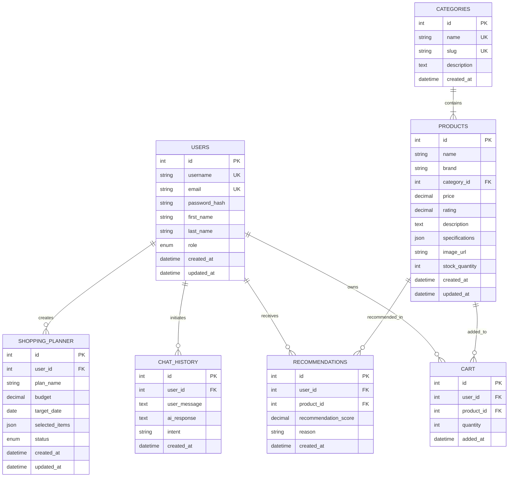

# Entity Relationship (ER) Diagram & Database Architecture

## 1. Overview
The **AI Shopping Assistant** database uses a normalized **MySQL 8.0** relational schema to guarantee data integrity, avoid redundancy, and enable fast analytical queries for AI recommendations.

---

## 2. ER Diagram (Mermaid Visual)

---

## 3. Detailed Relationship Explanation

### 1. `users` ↔ `cart` (One-to-Many)
- **Relation**: One User can have multiple items in their Cart.
- **Constraint**: Composite UNIQUE key on `(user_id, product_id)` ensures a product is listed once per user cart with an updated `quantity`.
- **Cascade**: `ON DELETE CASCADE` removes user cart items if the user account is deleted.

### 2. `categories` ↔ `products` (One-to-Many)
- **Relation**: One Category contains multiple Products.
- **Constraint**: `FOREIGN KEY (category_id) REFERENCES categories(id) ON DELETE RESTRICT`. A category cannot be deleted if products are assigned to it.

### 3. `products` ↔ `cart` (One-to-Many)
- **Relation**: One Product can be referenced in multiple user carts.
- **Cascade**: `ON DELETE CASCADE` removes cart line items if a product is deleted from the store catalog.

### 4. `users` ↔ `chat_history` (One-to-Many)
- **Relation**: Tracks conversational history between a specific user and Gemini AI assistant.
- **Purpose**: Context retention for multi-turn shopping queries.

### 5. `users` & `products` ↔ `recommendations` (Many-to-Many Junction)
- **Relation**: Stores AI-generated product recommendations for individual users with a confidence score (0.000 to 1.000) and reasoning text.

### 6. `users` ↔ `shopping_planner` (One-to-Many)
- **Relation**: Allows users to save targeted budget planning lists containing product references stored in a structured JSON payload.
